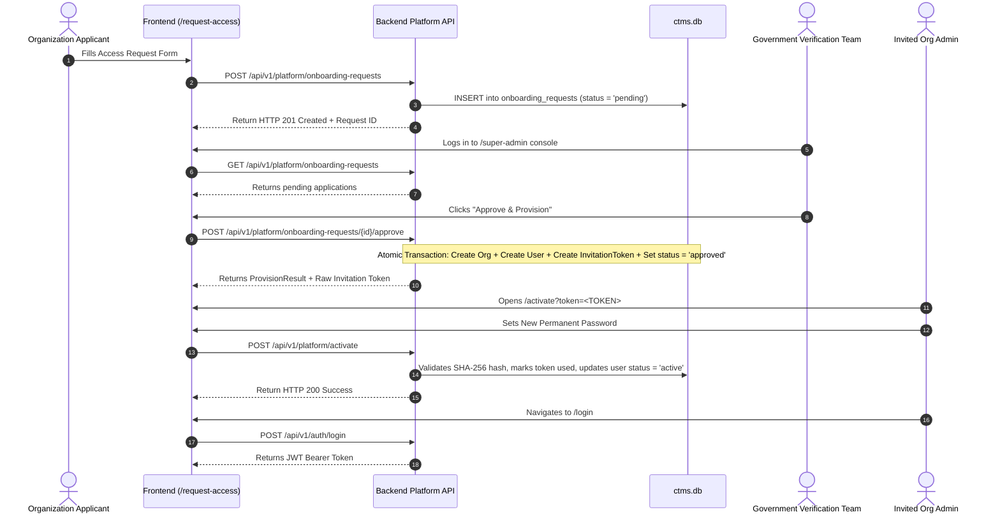

# AyuCTMS Authentication, Registration & Onboarding Flows

- **Evidence Category:** `RUNTIME_CONFIRMED`
- **Scope:** Public access request, Super Admin review, invitation tokens, activation, login, and force password change.

---

## 1. End-to-End Onboarding Lifecycle

---

## 2. Password Security & First-Login Policy

- **Hashing Algorithm:** `bcrypt` (12 rounds) adhering to OWASP minimum.
- **Minimum Length:** 8 characters.
- **Forced Password Change Mechanism:**
  - Column `users.must_change_password` (boolean).
  - When provisioned or bootstrapped via temporary password, `must_change_password = True`.
  - Upon authentication, if `must_change_password === true`, `AppShell` immediately opens the blocking `ForcePasswordChangeModal`.
  - User cannot dismiss modal or access operational screens until `POST /api/v1/platform/change-password` or `first-login-setup` completes.

---

## 3. Discovered Vulnerabilities & Deviations

1. **Email Domain Verification:**
   The public `/request-access` form does not validate corporate or institutional email domains. Generic webmail domains (e.g. `gmail.com`) are allowed and were used in the seed database (`nitinbhujwa@gmail.com`).
2. **Token Exposure in URL:**
   The activation link relies on query parameter `?token=...`, exposing the one-time token in server access logs and browser history.
3. **Session Termination on Password Change:**
   Changing password updates `password_changed_at` in the database, but does not actively revoke previously issued JWT tokens before their 24-hour expiry.
