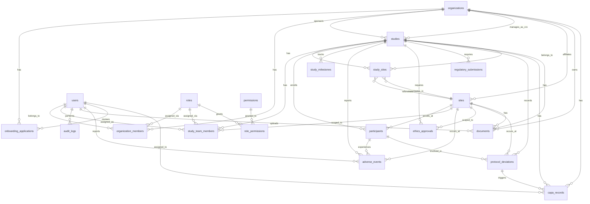

# CRO/Sponsor Platform — Entity Relationship Model

## Conceptual ER Diagram

## Entity Summary

| Entity | Table | Type | Primary Relationships |
|---|---|---|---|
| Organization | `organizations` | Master Data | Parent of members, sponsor/CRO of studies |
| Onboarding Application | `onboarding_applications` | Workflow Data | Belongs to organization, reviewed by user |
| User | `users` | Master Data | Member of organizations, team member of studies |
| Role | `roles` | Access Control | Scoped to system/org/study/site |
| Permission | `permissions` | Access Control | Granted to roles |
| Role-Permission | `role_permissions` | Relationship | Links roles to permissions |
| Organization Member | `organization_members` | Relationship | Links users to organizations with roles |
| Study | `studies` | Master Data | Central entity; references sponsor & CRO orgs |
| Site | `sites` | Master Data | Reusable research site entity |
| Study-Site | `study_sites` | Relationship | Links studies to sites with operational state |
| Study Team Member | `study_team_members` | Relationship | Links users to studies with roles and optional site scope |
| Participant | `participants` | Transactional | Enrolled in study, assigned to site |
| Study Milestone | `study_milestones` | Transactional | Progress tracking per study |
| Adverse Event | `adverse_events` | Transactional | Safety record per participant/study |
| Ethics Approval | `ethics_approvals` | Compliance | Per study, optionally per site |
| Regulatory Submission | `regulatory_submissions` | Compliance | Per study |
| Protocol Deviation | `protocol_deviations` | Compliance | Per study/site/participant |
| CAPA Record | `capa_records` | Compliance | Corrective/preventive actions |
| Document | `documents` | Document Metadata | Linked to org/study/site |
| Audit Log | `audit_logs` | System | Hash-chained immutable trail |

## Key Design Decisions

1. **Organizations as first-class entities** — CRO and Sponsor are `organization_type` enum values on the `organizations` table, not plain strings on `studies`.
2. **Study references organizations via FK** — `sponsor_org_id` and `cro_org_id` are foreign keys to `organizations.id`.
3. **Sites are reusable** — A site can participate in multiple studies via the `study_sites` junction table.
4. **PI and Coordinator are team roles** — Not stored as string columns on `studies`; derived through `study_team_members` with appropriate role.
5. **Dashboard KPIs are derived** — Counts (participants, sites, enrollment metrics) are computed from canonical records, never stored as duplicate counters.
6. **Documents store metadata only** — Binary files live in object storage; DB stores `storage_key`, `checksum`, and metadata.
7. **Audit is hash-chained** — Each `audit_logs` entry contains `entry_hash` (SHA-256 of its data + `previous_hash`) for tamper detection.
8. **Status transitions are state machines** — Implemented in the service layer, not as free PATCH updates.
